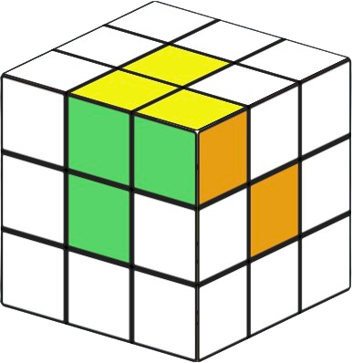

<!-- cspell:ignore nlogo promela scilab vcube benwh rokicki lgarron ditrus voltara infinidoge esqu1 Arhan Chaudhary Rovnyak korf -->
<p align="center">
    
</p>
<hr>

PROJECT STATUS: almost MVP; many features incomplete

Qter is a human-friendly Rubik's cube computer. This means you can compile a computer program and then act as a computer processor by physically turning a Rubik's cube to affect its computation, even if you have no knowledge of how computers work. Following is an example executable program that accepts an index as user input and computes the corresponding Fibonacci number. It is written in our custom Rubik's cube file format named Q:

`fib.q`
<!-- some alternatives: clarity cl el janet lfe lean nlogo opa pact promela scilab -->
```l
Puzzles
A: 3x3

1  | input "Which Fibonacci number to calculate: "
           B2 U2 L F' R B L2 D2 B R' F L
           max-input 8
2  | solved-goto UFR 4
3  | goto 5
4  | halt "The number is: 0"
5  | D L' F L2 B L' F' L B' D' L'
6  | L' F' R B' D2 L2 B' R' F L' U2 B2
7  | solved-goto UFR 9
8  | goto 10
9  | halt "The number is: "
          L D B L' F L B' L2 F' L D'
          counting-until DL DFL
10 | solved-goto DL DFL 13
11 | L U' B R' L B' L' U' L U R2 B R2 D2 R2 D'
12 | goto 10
13 | L' F' R B' D2 L2 B' R' F L' U2 B2
14 | solved-goto UFR 16
15 | goto 17
16 | halt "The number is: "
          F2 L2 U2 D' R U' B L' B L' U'
          counting-until FR DRF
17 | solved-goto FR DRF 20
18 | D' B' U2 B D' F' D L' D2
     F' R' D2 F2 R F2 R2 U' R'
19 | goto 17
20 | L' F' R B' D2 L2 B' R' F L' U2 B2
21 | solved-goto UFR 23
22 | goto 24
23 | halt "The number is: "
          U L' R' F' U' F' L' F2 L U R
          counting-until UF
24 | solved-goto UF 6
25 | B R2 D' R B D F2 U2 D'
     F' L2 F D2 F B2 D' L' U'
26 | goto 24
```

This was compiled from our custom high level programming language named QAT (Qter Assembly Text):

```janet
.registers {
    A, B, C, D <- 3x3 builtin (30, 18, 10, 9)
}

.macro fib-shuffle {
    ($R1:reg $R2:reg $R3:reg $counter:reg) => {
        dec $counter
        if solved $counter {
            halt "The number is" $R1
        }
        while not-solved $R1 {
            dec $R1
            inc $R2
            inc $R3
        }
    }
}

input "Which Fibonacci number to calculate:" D
if solved D {
    halt "The number is: 0"
}
inc B
loop {
    fib-shuffle B A C D
    fib-shuffle A C B D
    fib-shuffle C B A D
}
```

### Table of Contents

- [Usage](#usage)
  - [Physically running qter](#physically-running-qter)
    - [The Q file format](#the-q-file-format)
    - [Logical instructions](#logical-instructions)
    - [Advanced instructions](#advanced-instructions)
    - [Other twisty puzzles](#other-twisty-puzzles)
  - [Programming qter](#programming-qter)
    - [Compilation pipeline](#compilation-pipeline)
    - [Programming language](#programming-language)
- [Design](#design)
  - [Computer architecture](#computer-architecture)
  - [Programming language](#programming-language-1)
- [Technical details](#technical-details)
  - [Cycle combination solver](#cycle-combination-solver)
    - [Phase 1](#phase-1)
    - [Phase 2](#phase-2)
    - [Phase 2 with GAP](#phase-2-with-gap)
- [About the authors](#about-the-authors)
- [References](#references)
- [Acknowledgements](#acknowledgements)

# Usage

## Physically running qter

### The Q file format

The Q file format is qter's representation of a computer program in an executable Rubik's cube language. The file format was designed in such a way that, with only basic Rubik's cube knowledge, a human can physically manipulate a twisty puzzle to execute a program and perform a meaningful computation.

Qter doesn't just support 3x3x3 cubes, but it works with any twisty puzzle in the shape of a platonic solid. Since most people are most familiar with the 3x3x3 cube, we will introduce qter with the aforementioned from now on.

Q files are expected to be read from top to bottom. Each line indicates an instruction, the simplest of which is just an algorithm to perform on the cube. For example:

```l
Puzzles
A: 3x3

1 | U' R2
2 | L D'
...
```

The `Puzzles` declaration specifies the types of twisty puzzles used. In this example, it is declaring that you must start with a 3x3x3 cube, and that it has the name "A". The name is unimportant in this example, but becomes important when operating on multiple cubes. The instructions indicate that you must perform the moves U' R2 L D' on the Rubik's cube, given in [standard move notation](https://jperm.net/3x3/moves). You must begin with the cube solved before following the instructions.

The Q file format also includes special instructions that involve the twisty puzzle but require additional logic. These logical instructions are designed to be simple enough for humans to understand and perform.

### Logical instructions

Following this section, you should be able to entirely understand how to physically execute the example Fibonacci program provided at the beginning of this document. More complicated instructions are expanded upon in the next section.

- `goto <number>`

<ul>
When encountering this instruction, jump to the specified line number instead of reading on to the next line. For example:

```l
Puzzles
A: 3x3

1 | U' R2
2 | L D'
3 | goto 1
...
```

Indicates an infinite loop of performing U' R2 L D' on the Rubik's cube. After performing the algorithm, the `goto` instruction requires you to jump back to line 1 where you started.
</ul>

- `solved-goto <number> <positions>`

<ul>

If the specified positions on the puzzle each contain their solved piece, then jump to the line number specified as if it was a `goto` instruction. Otherwise, fall through and go to the next instruction. For example:

```l
Puzzles
A: 3x3

1 | U' R2
2 | solved-goto 4 UFR UF
3 | goto 1
4 | L D'
...
```

Indicates repeatedly performing U' R2 until the UFR corner position and UB edge position contain their solved pieces. Then, perform L D' on the Rubik's cube. Note that three faces uniquely identify any corner position and two faces uniquely identify any edge position on the Rubik's cube, hence UFR (up front right) and UF (up front).

Determining if a position contains its solved piece slightly varies from puzzle to puzzle, but the idea remains the same. For the Rubik's cube, this is the case when each face of the piece at the position is the same color as its center. The following illustrates a successful `solved-goto 4 UFR UF` instruction:



For other twisty puzzles, see [Other twisty puzzles](#other-twisty-puzzles).
</ul>

- `input <prompt> <moves> max-input <number>`

<ul>

This instruction facilitates arbitrary input from a user which will be stored and processed on the puzzle. To do so, repeat the given sequence of moves "your input" number of times. For example:

```l
Puzzles
A: 3x3

1 | input "Choose 0-5"
          R U R' U'
          max-input 5
...
```

To input the number two, execute the algorithm `(R U R' U') (R U R' U')` on the Rubik's cube. Notice that if you try to execute the algorithm six times, the cube will return to its solved state as if you had inputted the number zero. Thus, your input number must not be greater than five, and this is shown with the `max-input 5` syntax.

If a negative input is meaningful to the program you are executing, you can input negative one by performing the inverse of the algorithm. For example, negative two would be inputted as `(U R U' R') (U R U' R')`.

</ul>

- `halt`

<ul>
WIP
</ul>

- `switch`

<ul>
WIP
</ul>

### Advanced instructions

The Q file format thus far is theoretically equivalent to the computational facilities of a computer, an important theorem proven in the [computer architecture](#computer-architecture) section.

- `print`

<ul>
WIP
</ul>

- `push`

<ul>
WIP
</ul>

- `pop`

<ul>
WIP
</ul>

- `switch-top`

<ul>
WIP
</ul>

### Other twisty puzzles

To specify

WIP

## Programming qter

### Compilation pipeline

If you have experience working with a compiled programming language, you know that to run a program, you compile your source code into machine code that the computer processor then interprets and executes. The qter compilation pipeline works similarly.

### Programming language

# Design

Much of qter is heavily based on group theory, compiler theory, and programming language theory. We will only provide a simplified overview of these concepts to make our design principles and the rest of this document as accessible as possible.

## Computer architecture

Qter is similar in many ways to how modern computers work, yet at the same time esoteric by nature. This section will start with a light background of how Rubik's cubes work and then elaborate on the unique properties that make qter possible.

WIP

## Programming language

WIP

# Technical details

## Cycle combination solver

WIP

### Phase 1

WIP

### Phase 2

WIP

### Phase 2 with GAP

WIP

# About the authors

- Arhan Chaudhary: Hi! I am a sophomore at Purdue University, and I have always been fascinated by Rubik's cubes since I learned how to solve them in middle school. I was greatly inspired by the [Purdue Hackers](https://www.purduehackers.com/) community to begin this project, and have spent the better part of the entire school year working on it. I'm looking for Summer 2026 internships - and I'm particularly excited about working with startups. Read more about my work at my [website](https://arhan.sh/).
- Henry Rovnyak (_jumps off of a catwalk and lands behind you_): Hello there! Like Arhan, I too am a sophomore at Purdue University. I'm interested in math and programming, and I met Arhan through this project and the Purdue Hackers community. I enjoy systems and scientific programming, but I also have a soft spot for theoretical work and frontend design. Arhan may or may not have gotten me addicted to cubes... I'm also interested in Summer 2026 internships, and you should consider checking out [my website](https://hrovnyak.gitlab.io/) to see some of the other stuff I've been working on.
- Asher Gray: I am neither a sophomore nor a Purdue University. I love studying math, solving Rubik's cubes, and making videos about them! I recently made a video about using the cube as a calculator, then Arhan reached out and invited me to help out with a similar project he'd been working on, qter! It has been a lot of fun. You can find me on [YouTube](https://m.youtube.com/channel/UCJZt93WO-evfsfi7YlVmrQA) or enjoy some interactive math visualizations on my [website](https://thegraycuber.github.io/).

# References
<!-- cspell:disable -->
[1] Bergvall, O., Hynning, E., Hedberg, M., Mickelin, J., & Masawe, P. (2010). On Rubik’s cube. *Report, KTH Royal Institute of Technology* (pp. 65-73). \
[2] Rokicki, T., Kociemba, H., Davidson, M., & Dethridge, J. (2014). The diameter of the rubik's cube group is twenty. *siam REVIEW, 56*(4), 645-670.
<!-- cspell:enable -->
# Acknowledgements

- [@lgarron](https://github.com/lgarron) and [@esqu1](https://github.com/esqu1) for reference Korf's algorithm implementations ([1](https://github.com/cubing/twsearch/blob/efb207e11162174360e3ae49aa552cda1313df81/src/rs/_internal/search/idf_search.rs#L340) and [2](https://github.com/esqu1/Rusty-Rubik/blob/1e32829e83c662816bd85f6c37d6f774a15e3aea/src/solver.rs#L123)).
- [@ScriptRacoon](https://github.com/ScriptRacoon) for providing developmental [code](https://gist.github.com/ScriptRaccoon/c12c4884c116dead62a15a3d09732d5d) for phase 1.
- [@rokicki](https://github.com/rokicki) for designing the [PuzzleGeometry format](https://alpha.twizzle.net/explore/help.html) and [reference code](https://github.com/cubing/cubing.js/blob/main/src/cubing/puzzle-geometry/PuzzleGeometry.ts).
- [@benwh1](https://github.com/benwh1) and [@adrian154](https://github.com/adrian154) for miscellaneous puzzle theory insights.
- [@DitrusNight](https://github.com/DitrusNight) for advising our programming language design.
- [@Infinidoge](https://github.com/Infinidoge) for generously providing access to powerful hardware for the cycle combination solver.
