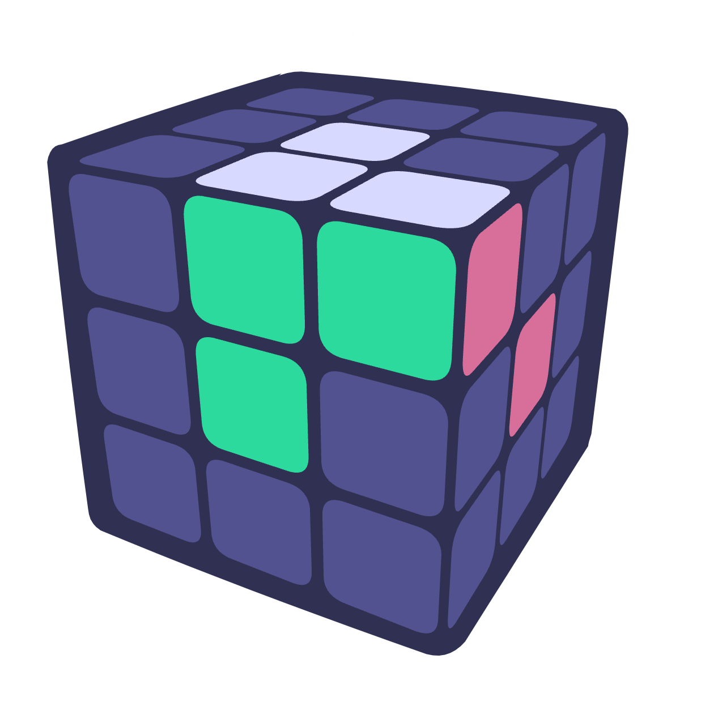
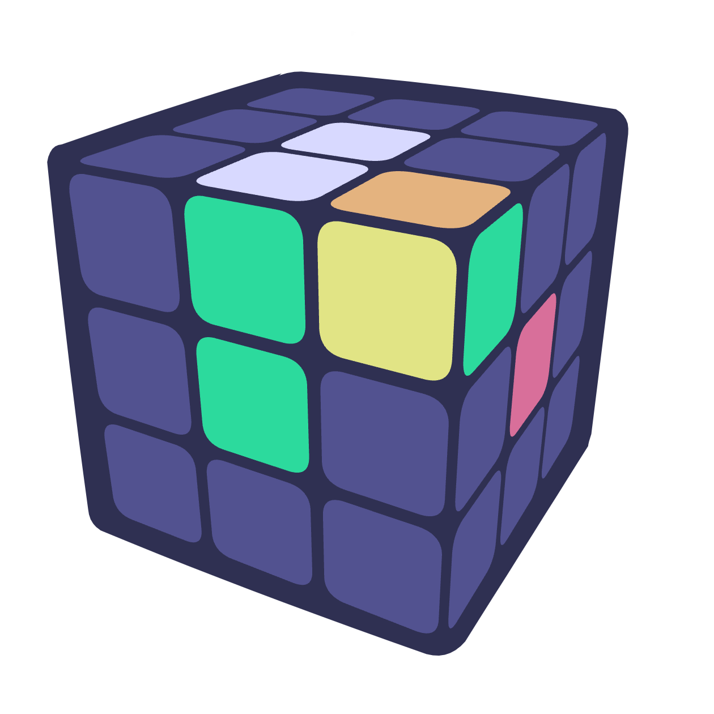
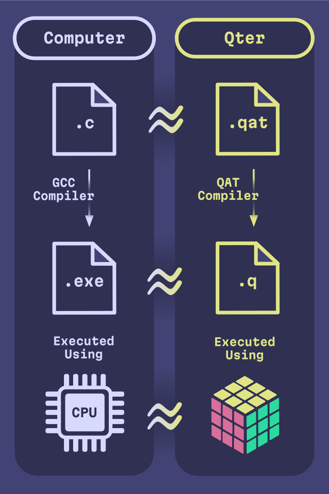

<!-- cspell:ignore nlogo promela scilab vcube benwh rokicki lgarron ditrus voltara infinidoge esqu1 Arhan Chaudhary Rovnyak korf twizzle metaprogramming cubies -->
<p align="center">
    
</p>
<hr>

PROJECT STATUS: almost MVP; many features incomplete

Qter is a human-friendly Rubik's cube computer. This means you can compile a computer program and then act as a computer processor by physically turning a Rubik's cube to affect its computation, even if you have no knowledge of how computers work. Following is an example executable program that accepts an index as user input and computes the corresponding Fibonacci number. It is written in our custom Rubik's cube file format named Q:

`fib.q`
<!-- some alternatives: clarity cl el janet lfe lean nlogo opa pact promela scilab -->
```l
Puzzles
A: 3x3

1  | input "Which Fibonacci number to calculate: "
           B2 U2 L F' R B L2 D2 B R' F L
           max-input 8
2  | solved-goto UFR 4
3  | goto 5
4  | halt "The number is: 0"
5  | D L' F L2 B L' F' L B' D' L'
6  | L' F' R B' D2 L2 B' R' F L' U2 B2
7  | solved-goto UFR 9
8  | goto 10
9  | halt "The number is: "
          L D B L' F L B' L2 F' L D'
          counting-until DL DFL
10 | solved-goto DL DFL 13
11 | L U' B R' L B' L' U' L U R2 B R2 D2 R2 D'
12 | goto 10
13 | L' F' R B' D2 L2 B' R' F L' U2 B2
14 | solved-goto UFR 16
15 | goto 17
16 | halt "The number is: "
          F2 L2 U2 D' R U' B L' B L' U'
          counting-until FR DRF
17 | solved-goto FR DRF 20
18 | D' B' U2 B D' F' D L' D2
     F' R' D2 F2 R F2 R2 U' R'
19 | goto 17
20 | L' F' R B' D2 L2 B' R' F L' U2 B2
21 | solved-goto UFR 23
22 | goto 24
23 | halt "The number is: "
          U L' R' F' U' F' L' F2 L U R
          counting-until UF
24 | solved-goto UF 6
25 | B R2 D' R B D F2 U2 D'
     F' L2 F D2 F B2 D' L' U'
26 | goto 24
```

This was compiled from our custom high level programming language named QAT (Qter Assembly Text):

```janet
.registers {
    A, B, C, D <- 3x3 builtin (30, 18, 10, 9)
}

.macro fib-shuffle {
    ($R1:reg $R2:reg $R3:reg $counter:reg) => {
        dec $counter
        if solved $counter {
            halt "The number is" $R1
        }
        while not-solved $R1 {
            dec $R1
            inc $R2
            inc $R3
        }
    }
}

input "Which Fibonacci number to calculate:" D
if solved D {
    halt "The number is: 0"
}
inc B
loop {
    fib-shuffle B A C D
    fib-shuffle A C B D
    fib-shuffle C B A D
}
```

### Table of Contents

- [Physically running qter](#physically-running-qter)
  - [The Q file format](#the-q-file-format)
  - [Logical instructions](#logical-instructions)
  - [Advanced instructions](#advanced-instructions)
  - [Other twisty puzzles](#other-twisty-puzzles)
- [The QAT programming language](#the-qat-programming-language)
  - [Your first QAT program](#your-first-qat-program)
  - [Metaprogramming](#metaprogramming)
  - [Prelude](#prelude)
  - [The stack](#the-stack)
- [Computer architecture design](#computer-architecture-design)
  - [Rubik's cube theory](#rubiks-cube-theory)
  - [Cycles are registers](#cycles-are-registers)
  - [Conditional branching](#conditional-branching)
  - [The Rubik's cube is a computer](#the-rubiks-cube-is-a-computer)
- [Technical details](#technical-details)
  - [Cycle combination solver](#cycle-combination-solver)
    - [Phase 1](#phase-1)
    - [Phase 2](#phase-2)
    - [Experimental phase 3 with GAP](#experimental-phase-3-with-gap)
- [About the authors](#about-the-authors)
- [References](#references)
- [Acknowledgements](#acknowledgements)

# Physically running qter

## The Q file format

The Q file format is qter's representation of a computer program in an executable Rubik's cube language. The file format was designed in such a way that, with only basic Rubik's cube knowledge, a human can physically manipulate a twisty puzzle to execute a program and perform a meaningful computation.

Qter doesn't just support 3x3x3 cubes, but it works with any twisty puzzle in the shape of a platonic solid. Since most people are most familiar with the 3x3x3 cube, we will introduce qter with the aforementioned from now on.

Q files are expected to be read from top to bottom. Each line indicates an instruction, the simplest of which is just an algorithm to perform on the cube. For example:

```l
Puzzles
A: 3x3

1 | U' R2
2 | L D'
...
```

The `Puzzles` declaration specifies the types of twisty puzzles used. In this example, it is declaring that you must start with a 3x3x3 cube, and that it has the name "A". The name is unimportant in this example, but becomes important when operating on multiple cubes. The instructions indicate that you must perform the algorithm `U' R2 L D'` on the Rubik's cube, given in [standard move notation](https://jperm.net/3x3/moves). You must begin with the cube solved before following the instructions.

The Q file format also includes special instructions that involve the twisty puzzle but require additional logic. These logical instructions are designed to be simple enough for humans to understand and perform.

## Logical instructions

Following this section, you should be able to understand how to physically execute the example Fibonacci program provided at the beginning of this document. More complicated instructions are expanded upon in the next section.

- `goto <number>`

<ul>

Jump to the specified line number instead of reading on to the next line. For example:

```l
Puzzles
A: 3x3

1 | U' R2
2 | L D'
3 | goto 1
...
```

Indicates an infinite loop of performing `U' R2 L D'` on the Rubik's cube. After performing the algorithm, the `goto` instruction requires you to jump back to line 1 where you started.

</ul>

- `solved-goto <number> <positions>`

<ul>

If the specified positions on the puzzle each contain their solved piece, then jump to the line number specified as if it was a `goto` instruction. Otherwise, fall through and go to the next instruction. For example:

```l
Puzzles
A: 3x3

1 | U' R2
2 | solved-goto 4 UFR UF
3 | goto 1
4 | L D'
...
```

Indicates repeatedly performing `U' R2` until the UFR corner position and UB edge position contain their solved pieces. Then, perform `L D'` on the Rubik's cube. Note that three faces uniquely identify any corner position and two faces uniquely identify any edge position on the Rubik's cube, hence UFR (up front right) and UF (up front).

Determining if a position contains its solved piece slightly varies from puzzle to puzzle, but the idea remains the same. For the Rubik's cube, this is the case when each face of the piece at the position is the same color as its center.

The following illustrates a successful `solved-goto 4 UFR UF` instruction where you would jump to line 4:



The following illustrates an unsuccessful `solved-goto 4 UFR UF` instruction where you would skip it and continue to the next instruction. Note that _all_ pieces specified need to be in their solved positions, not just one:



For other twisty puzzles, see [Other twisty puzzles](#other-twisty-puzzles).

</ul>

- `input <prompt> <algorithm> max-input <number>`

<ul>

This instruction facilitates arbitrary input from a user which will be stored and processed on the puzzle. To do so, repeat the given algorithm "your input" number of times. For example:

```l
Puzzles
A: 3x3

1 | input "Choose 0-5"
          R U R' U'
          max-input 5
...
```

To input the number two, execute the algorithm `(R U R' U') (R U R' U')` on the Rubik's cube. Notice that if you try to execute `R U R' U'` six times, the cube will return to its solved state as if you had inputted the number zero. Thus, your input number must not be greater than five, and this is shown with the `max-input 5` syntax.

If a negative input is meaningful to the program you are executing, you can input negative one by performing the inverse of the algorithm. For example, negative two would be inputted as `(U R U' R') (U R U' R')`.

</ul>

- `halt <message> [<algorithm> counting-until <positions>]`

<ul>

This instruction terminates the program and gives an output, and it is similar to the `input` instruction. To decode the output of the program, repeat the given algorithm until the positions given are solved (see the `solved-goto` instruction). The number of repetitions it took to solve the given pieces along with the specified message is considered the output of the program. For example:

```l
Puzzles
A: 3x3

1 | input "Choose 0-5"
          R U R' U'
          max-input 5
2 | halt "You chose"
          U R U' R'
          counting-until UFR
```

In this example, after performing the input and reaching the halt instruction, you would have to repeat `U R U' R'` until the UFR corner is solved. For example, if you inputted the number two by performing `(R U R' U') (R U R' U')`, the expected output will be two, since you have to perform `U R U' R'` twice to solve the UFR corner. Therefore, the expected output of the program is "You chose 2".

If the program does not require giving a numeric output, then the algorithm may be left out. For example:

```l
Puzzles
A: 3x3

1 | halt "I halt immediately"
```

</ul>

- `switch <letter>`

<ul>

Put down your current puzzle and pick up a different one, labeled by letter in the `Puzzles` declaration. It is important that you do not rotate the puzzle when setting it aside or picking it back up. For example:

```l
Puzzles
A: 3x3
B: 3x3

1 | U
2 | switch B
3 | R
...
```

this program requires two Rubik's cubes to execute. The instructions indicate performing `U` on the first Rubik's cube and then `R` on the second. When the program starts, you are expected to be holding the first cube in the list.

</ul>

## Advanced instructions

The Q file format thus far is theoretically equivalent to a classical computer, as demonstrated in the [computer architecture design](#computer-architecture-design) section. This section details advanced instructions that the Q file format supports.

- `print <message> [<algorithm> counting-until <positions>]`

<ul>

This is an optional instruction that you may choose to ignore. The `print` instruction serves as a secondary mechanism to produce output without exiting the program. The motivation stems from the fact that, without this instruction, the only form of meaningful output is the single number produced by the `halt` instruction.

To execute this instruction, repeat the given algorithm until the positions are solved, analogous to the halt instruction. The number of repetitions this took is then the output of the print statement. Then, you must perform the inverse of the algorithm the same number of times, undoing what you just did and returning the cube to the state it was in before executing the print instruction. For example:

```l
Puzzles
A: 3x3

1 | R U R2 B2 U L U' L' D' R' D R B2 U2
2 | print "This should output ten:"
          R U counting-until UFR UF
3 | halt "This should also output ten:"
          R U counting-until UFR UF
```

Like the `halt` instruction, including just a message is legal. In this case, you can skip this instruction as there is nothing to do. For example:

```l
Puzzles
A: 3x3

1 | print "Just a friendly debugging message :-)"
...
```

</ul>

Talk about the stack here WIP (Henry you could write the rest of this section if you want)

- `push`

<ul>

WIP

Talking points:

- Will need many puzzles

</ul>

- `pop`

<ul>

WIP

</ul>

- `switch-top`

<ul>

WIP

</ul>

## Other twisty puzzles

WIP

Talking points:

- The `Puzzles` declaration accepts a hard-coded puzzle name or a PuzzleGeometry description
- PuzzleGeometry is a format developed and designed by Tomas Rokicki that generates a puzzle definition from a simple description. You can read more about it [here](https://alpha.twizzle.net/explore/help.html) or use the format interactively on [Twizzle Explorer](https://alpha.twizzle.net/explore) (click "Config").

# The QAT programming language

This section assumes moderate familiarity with an existing programming language, such as Python, JavaScript, or C.

## Your first QAT program



If you have experience working with a compiled programming language, you know that to run a program, you compile your source code into machine code that the computer processor then interprets and executes. The qter compilation pipeline works similarly.


Qter's high level programming language is called QAT, or Qter Assembly Text.

WIP

Talking points:

- bare bones QAT program without macros

<ul>

```l
.registers {
    A, B <- 3x3 builtin (90, 90)
}

    input "First number:" A
    input "Second number:" B
loop:
    add A 1
    add B 89
    solved-goto B found_total
    goto loop
found_total:
    add A 1
divide_by_2:
    add A 89
    solved-goto A stop
    add A 89
    solved-goto A stop
    add B 1
    goto divide_by_2
stop:
    halt "The average is" B
```

</ul>

- guide on how to use the CLI
- explain variables (.registers declaration), labels, and primitive instructions

## Metaprogramming

WIP

Talking points:

- macros
- .define
- lua

## Prelude

WIP

Talking points:

- convenience macros like `inc`, `dec`, and control flow
- [Link to prelude](src/qter_core/prelude.qat) and encourage its reference

## The stack

WIP

Talking points:

- functions and recursion

# Computer architecture design

Qter is similar in many ways to how modern computers work, yet at the same time esoteric by nature. This section will start with a light background of how Rubik's cubes work and then elaborate on the unique properties that make qter possible.

## Rubik's cube theory

WIP

Talking points:

- Define move as a manipulation of the cube and algorithm as a sequence of moves
- Optionally reintroduce [standard move notation](https://jperm.net/3x3/moves)
- Centers do not move
- If you repeat a constant sequence of moves on the Rubik's cube starting from the solved state, you will eventually reach the solved state after enough repetitions & proof
- The states that the repetitions of an algorithm visits before repeating form that algorithm's cycle
- Define order as # of repetitions

## Cycles are registers

WIP

Talking points:

- A register is a unit of storage in a computer. Think of it like memory — it can stores a value and update the value stored any time
- Use the U cycle to demonstrate a register of order 4 meaning it returns to its original state with 4 moves. Emphasize mod 4
- The value of this cycle's corresponding register, is the Nth step (or index) of the algorithm
- We have a way to increment a register by a constant
- 1260 order is maximal [[1](#ref-1)] and not enough for any meaningful computation
- Generalize the notion of a register to multiple cycles that coexist on the Rubik's cube
- The set of pieces affected by a given cycle must not interfere with the set of pieces affected by any other cycle. Helpful to think no longer in terms of moves but in cycles as in these pieces may be moved but they are restored. If the pieces were to interfere, then this would mean modifying the value of one register has a side effect of modifying the value of another unintended register.
- More registers mean more states 90*90 > 1260

## Conditional branching

WIP

Talking points:

- We have defined a way to represent a register on a Rubik's cube, but how does this bring us closer to a computer?
- We are limited in what we can do if the only operation our computer is able to perform on its memory is adding a constant
- Allow conditionally executing code
- Recall from U cycle, when the pieces of a cycle are solved, the register value is 0 because there are zero repetitions of the algorithm
- A piece is solved if the colors on each of its faces match the center of the corresponding side of a Rubik's cube
- If a register value is zero, then we conditionally execute some code, if not, execute some other code

## The Rubik's cube is a computer

WIP

Talking points:

- store instruction memory separate to the cube
- dissect an example
- works with any twisty puzzle

# Technical details

## Cycle combination solver

Qter's cycle combination solver computes the optimal computer architecture for a puzzle using any amount of cycles.

### Phase 1

WIP

Talking points

- Based on [[1](#ref-1)]
- Find all ways to assign cubies to orbits, then find the max order using partitions and priority queue
- Pareto front

### Phase 2

WIP

Talking points

- Korf's algorithm
- Symmetry and inverse reduction [[2](#ref-2)]

### Experimental phase 3 with GAP

WIP

Talking points

- Stabilizers
- Conjugacy classes
- Fork of optimal solver

# About the authors

- Arhan Chaudhary: Hi! I am a sophomore at Purdue University, and I have always been fascinated by Rubik's cubes since I learned how to solve them in middle school. I was greatly inspired by the [Purdue Hackers](https://www.purduehackers.com/) community to begin this project, and have spent the better part of the entire school year working on it. I'm looking for Summer 2026 internships - and I'm particularly excited about working with startups. Read more about my work at my [website](https://arhan.sh/).
- Henry Rovnyak: (_jumps off of a catwalk and lands behind you_) Hello there! Like Arhan, I too am a sophomore at Purdue University. I'm interested in math and programming, and I met Arhan through this project and the Purdue Hackers community. I enjoy systems and scientific programming, but I also have a soft spot for theoretical work and frontend design. Arhan may or may not have gotten me addicted to cubes... I'm also interested in Summer 2026 internships, and you should consider checking out [my website](https://hrovnyak.gitlab.io/) to see some of the other stuff I've been working on.
- Asher Gray: Hello! I'm a data analyst and youtuber from the PNW. I started off making videos about solving Rubik's cubes blindfolded, and now focus on math and fun ways to visualize it. Lately I've been studying the theory of abelian groups, including the abelian subgroups of the Rubik's cube. I'm excited to have joined this project, such an interesting application of these ideas! You can find me on [YouTube](https://m.youtube.com/channel/UCJZt93WO-evfsfi7YlVmrQA) or enjoy some interactive math visualizations on my [website](https://thegraycuber.github.io/).

# References
<!-- cspell:disable -->
[<span id="ref-1">1</span>] Bergvall, O., Hynning, E., Hedberg, M., Mickelin, J., & Masawe, P. (2010). On Rubik’s cube. _Report, KTH Royal Institute of Technology_ (pp. 65-79). \
[<span id="ref-2">2</span>] Rokicki, T., Kociemba, H., Davidson, M., & Dethridge, J. (2014). The diameter of the rubik's cube group is twenty. _siam REVIEW, 56_(4), 645-670.
<!-- cspell:enable -->
# Acknowledgements

- [@lgarron](https://github.com/lgarron) and [@esqu1](https://github.com/esqu1) for reference Korf's algorithm implementations ([1](https://github.com/cubing/twsearch/blob/efb207e11162174360e3ae49aa552cda1313df81/src/rs/_internal/search/idf_search.rs#L340) and [2](https://github.com/esqu1/Rusty-Rubik/blob/1e32829e83c662816bd85f6c37d6f774a15e3aea/src/solver.rs#L123)).
- [@ScriptRacoon](https://github.com/ScriptRacoon) for providing developmental [code](https://gist.github.com/ScriptRaccoon/c12c4884c116dead62a15a3d09732d5d) for phase 1.
- [@rokicki](https://github.com/rokicki) for designing the [PuzzleGeometry format](https://alpha.twizzle.net/explore/help.html).
- [@benwh1](https://github.com/benwh1) and [@adrian154](https://github.com/adrian154) for miscellaneous puzzle theory insights.
- [@DitrusNight](https://github.com/DitrusNight) for advising our programming language design.
- [@Infinidoge](https://github.com/Infinidoge) for generously providing access to powerful hardware for the cycle combination solver.
