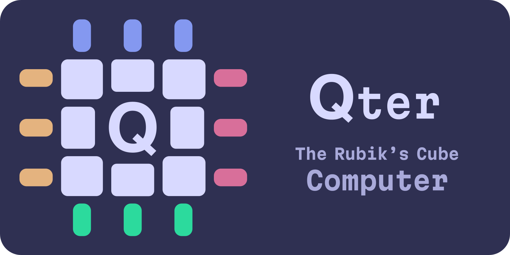

<p align="center">
    
</p>
<hr>

> [!NOTE]
> Qter is currently an incomplete work-in-progress

[Qter](https://qter.dev/) is a computer architecture that allows humans to perform computations by manipulating the Rubik's Cube (or any twisty puzzle) by hand. Following is an example executable program that accepts an index as user input and computes the corresponding Fibonacci number, written in our custom twisty puzzle file format named *Q*. It can be physically executed by a human without needing to know how computers work.

`fib.q`
<!-- some alternatives: clarity cl el janet lfe lean nlogo opa pact promela scilab -->
```l
Puzzles
A: 3x3

1 | input "Which Fibonacci number to calculate:"
           B2 U2 L F' R B L2 D2 B R' F L
           max-input 8
2 | solved-goto UFR 14
3 | D L' F L2 B L' F' L B' D' L'
4 | L' F' R B' D2 L2 B' R' F L' U2 B2
5 | solved-goto UFR 15
6 | repeat until DL DFL solved
            L U' B R' L B' L' U'
            L U R2 B R2 D2 R2 D'
7 | L' F' R B' D2 L2 B' R' F L' U2 B2
8 | solved-goto UFR 16
9 | repeat until FR DRF solved
            D' B' U2 B D' F' D L' D2
            F' R' D2 F2 R F2 R2 U' R'
10 | L' F' R B' D2 L2 B' R' F L' U2 B2
11 | solved-goto UFR 17
12 | repeat until UF solved
            B R2 D' R B D F2 U2 D'
            F' L2 F D2 F B2 D' L' U'
13 | goto 4
14 | halt "The number is: 0"
15 | halt until DL DFL solved
          "The number is"
          L D B L' F L B' L2 F' L D'
16 | halt until FR DRF solved
          "The number is"
          F2 L2 U2 D' R U' B L' B L' U'
17 | halt until UF solved
          "The number is"
          U L' R' F' U' F' L' F2 L U R
```

This was compiled from our custom high level programming language named *QAT* (Qter Assembly Text):

`fib.qat`

```janet
.registers {
    A, B, C, D <- 3x3 builtin (30, 18, 10, 9)
}

.macro fib-shuffle {
    ($R1:reg $R2:reg $R3:reg $counter:reg) => {
        dec $counter
        if solved $counter {
            halt "The number is" $R1
        }
        while not-solved $R1 {
            dec $R1
            inc $R2
            inc $R3
        }
    }
}

input "Which Fibonacci number to calculate:" D
if solved D {
    halt "The number is: 0"
}
inc B
loop {
    fib-shuffle B A C D
    fib-shuffle A C B D
    fib-shuffle C B A D
}
```

# Installation

WIP

# Usage

WIP

# How does Qter work?

This repository hosts a suite of various twisty puzzle utilities to compile *QAT* programs to *Q*:

- `puzzle_geometry`: Convert an arbitrary polyhedra and cutting planes into a twisty puzzle
- `cycle_combination_finder`: Discover Qter architectures on a twisty puzzle
- `cycle_combination_solver`: Solve for a Qter architecture on a twisty puzzle
- `pog_ans`: Implementation of [tabled asymmetric numerical systems](https://en.wikipedia.org/wiki/Asymmetric_numeral_systems#Tabled_variant_(tANS)) compression for use in pruning tables
- `movecount_coefficient_calculator`: [Rewrite](https://www.speedsolving.com/threads/movecount-coefficient-calculator-online-tool-to-evaluate-the-speed-of-3x3-algorithms.79025/) of [trangium](https://github.com/trangium)'s online tool to score twisty puzzle move sequences by how easy they are to physically perform
- `compiler`: Compile *QAT* code to the *Q* file format
- `interpreter`: Simulate a twisty puzzle to execute *QAT* or *Q*
- `robot`: Stepper motor control software for the Qter robot
- `visualizer`: Qter program execution visualizer tool

Refer to [our paper](https://qter.dev/paper.pdf) for a comprehensive technical breakdown of the mathematics and programming behind Qter.

# About the Authors

- Arhan Chaudhary: Hi! I am a junior at Purdue University, and I have always been fascinated by Rubik's cubes since I learned how to solve them in middle school. I was greatly inspired by the [Purdue Hackers](https://www.purduehackers.com/) community to begin this project, and have spent the better part of the entire school year working on it. I'm looking for Summer 2026 internships - and I'm particularly excited about working with startups. Read more about my work at my [website](https://arhan.sh/).
- Henry Rovnyak: Hello there! Like Arhan, I too am a junior at Purdue University. I'm interested in math and programming, and I met Arhan through this project and the Purdue Hackers community. I enjoy systems and scientific programming, but I also have a soft spot for theoretical work and frontend design. Arhan may or may not have gotten me addicted to cubes... You should consider checking out [my website](https://rovnyak.net/) to see some of the other stuff I've been working on.
- Asher Gray: Hello! I'm a data analyst and youtuber from the PNW. I started off making videos about solving Rubik's cubes blindfolded, and now focus on math and fun ways to visualize it. Lately I've been studying the theory of abelian groups, including the abelian subgroups of the Rubik's cube. I'm excited to have joined this project, such an interesting application of these ideas! You can find me on [YouTube](https://m.youtube.com/channel/UCJZt93WO-evfsfi7YlVmrQA) or enjoy some interactive math visualizations on my [website](https://thegraycuber.github.io/).

# Acknowledgements

We extend our sincere thanks to [Tomas Rokicki](https://github.com/rokicki) for personally providing us key insight into Rubik's Cube programming techniques. Qter would not have been possible without his guidance. We are immensely grateful for his time.

We also extend our gratitude to [Ben Whitmore](https://github.com/benwh1) for helping ideate the initial design of the `cycle_combination_solver`.
